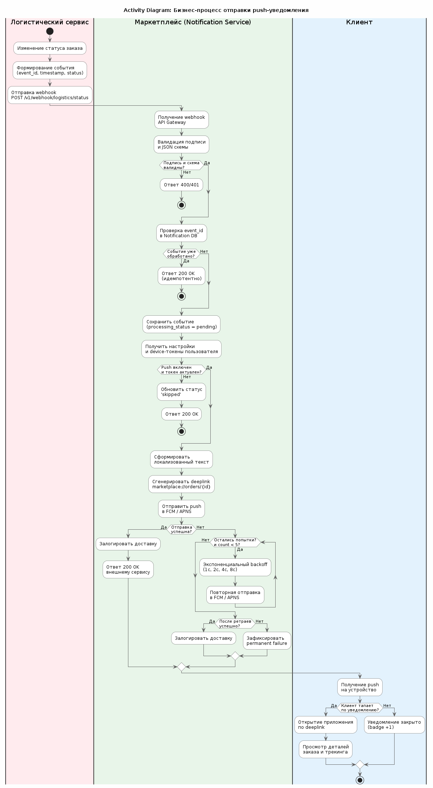
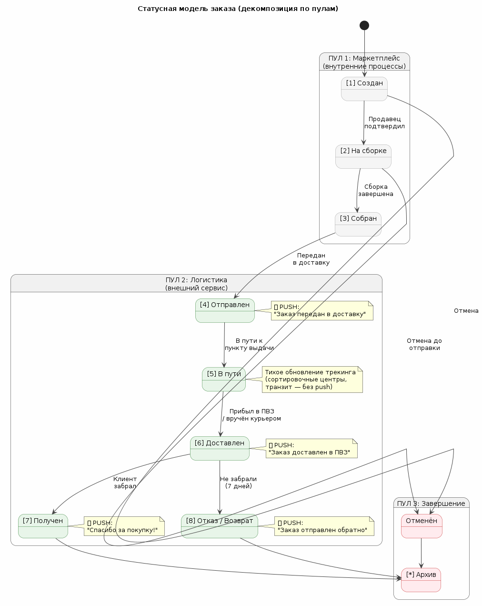

# Тестовое задание: Проектирование механизма отправки уведомлений о доставке

## 1. Бизнес-контекст и границы задачи

**Продукт:** Онлайн-маркетплейс товаров с нативными мобильными приложениями (iOS/Android).

**Цель:** Информировать пользователя об изменении статуса заказа в режиме, близком к реальному времени.

**Источник данных:** Внешний логистический сервис (служба доставки), который управляет физическим перемещением заказа и является единственным источником правды о статусе доставки.

**Канал доставки:** Push-уведомления через Firebase Cloud Messaging (FCM) / Apple Push Notification Service (APNS).

**Границы задачи (In Scope):**
- Получение статусных событий от внешнего логистического сервиса
- Обработка, дедупликация и валидация входящих событий
- Отправка push-уведомлений в мобильное приложение при ключевых изменениях логистического статуса
- Учёт пользовательских настроек уведомлений

**За границами задачи (Out of Scope):**
- Внутренние статусы маркетплейса (создан, оплачен, собран) — не инициируют push в рамках данной задачи
- Платёжные статусы (банковский контур)
- SMS/email как основные каналы
- Логистика возврата денежных средств

---

## 3.1 Функциональные и нефункциональные требования

### 3.1.1 Функциональные требования (FR)

| ID | Требование |
|---|---|
| **FR-01** | Система получает изменения статуса доставки из API внешнего логистического сервиса |
| **FR-02** | При каждом изменении ключевого логистического статуса заказа система отправляет push-уведомление в мобильное приложение пользователя |
| **FR-03** | Обработка событий идемпотентна: повторный webhook с тем же `event_id` не порождает дублирующее уведомление |
| **FR-04** | Поддерживается механизм ретраев при недоступности push-провайдера (FCM/APNS) |
| **FR-05** | Пользователь может отключить push-уведомления о доставке в настройках приложения; при отключении события обрабатываются и логируются, но push не отправляется |
| **FR-06** | Система формирует текст push-уведомления на языке пользователя (RU/EN/др.) на основе настроек профиля |
| **FR-07** | Push-уведомление содержит deeplink на экран деталей заказа в мобильном приложении |
| **FR-08** | Система ведёт аудит-лог всех попыток отправки push |

### 3.1.2 Нефункциональные требования (NFR)

| ID | Требование |
|---|---|
| **NFR-01** | Задержка между изменением статуса во внешнем сервисе и отправкой push ≤ 30 секунд (p95) |
| **NFR-02** | Доступность сервиса уведомлений 99.9% |
| **NFR-03** | Пропускная способность: обработка ≥ 1000 статусных событий/мин в пиковые часы |
| **NFR-04** | Ретраи при ошибках отправки выполняются с экспоненциальным бэкоффом (1с, 2с, 4с, 8с, макс. 5 попыток) |
| **NFR-05** | Идемпотентность на всех границах: повторный вызов с одним `event_id` не создаёт дубли вне зависимости от точки отказа |
| **NFR-06** | Интеграция защищена HMAC-SHA256 подписью или mTLS |
| **NFR-07** | Device-токены не хранятся в открытом виде; используется хеширование |
| **NFR-08** | Сервис обработки горизонтально масштабируется добавлением инстансов |

---

## 3.1.3 Бизнес-процесс

### Описание шагов бизнес-процесса

1. **Логистический сервис** фиксирует изменение статуса и формирует событие с `event_id`
2. **API Gateway** маркетплейса принимает webhook, валидирует HMAC-подпись и JSON-схему
3. **Notification Service** проверяет `event_id` на дубликат, получает настройки пользователя
4. При включённых уведомлениях формируется локализованный push с deeplink
5. **FCM/APNS** доставляет push на устройство клиента
6. **Клиент** тапает по уведомлению — открывается экран заказа в приложении

---

## 3.1.4 Статусная модель

### State Machine Diagram

### Статусы, инициирующие push-уведомление

| Статус | Текст уведомления (RU) | Текст уведомления (EN) |
|---|---|---|
| `[4] Отправлен` | «Заказ передан в доставку» | «Your order has been shipped» |
| `[6] Доставлен` | «Заказ доставлен в пункт выдачи» | «Your order is at the pickup point» |
| `[7] Получен` | «Спасибо за покупку!» | «Thank you for your purchase!» |
| `[8] Отказ/Возврат` | «Заказ отправлен обратно» | «Your order is being returned» |

**Статусы без push:** `[1] Создан`, `[2] На сборке`, `[3] Собран`, `[5] В пути` (микро-шаги трекинга обновляются тихо в приложении).

---

## 3.2 Структура API взаимодействия с внешним сервисом

### 3.2.1 Общие принципы

| Принцип | Описание |
|---|---|
| **Webhook primary** | Основной канал получения статусов — асинхронные HTTP-вызовы от логистического сервиса на наш endpoint |
| **Polling fallback** | При недоступности webhook или для реконсиляции данных маркетплейс сам запрашивает статусы у внешнего сервиса |
| **Версионирование** | Все endpoint'ы содержат версию в пути: `/v1/` |
| **Аутентификация входящих вызовов** | HMAC-SHA256 подпись тела запроса в заголовке `X-Signature` |
| **Идемпотентность** | Каждое событие имеет глобальный UUID (`event_id`), который используется как ключ дедупликации |

### 3.2.2 Входящий webhook (внешний сервис → маркетплейс)

**Endpoint:** `POST /v1/webhook/logistics/status`

**Кто вызывает:** Внешний логистический сервис (СДЭК, Boxberry и т.д.)  
**Кто реализует:** Маркетплейс (API Gateway)  
**Назначение:** Асинхронное уведомление об изменении логистического статуса заказа

**Заголовки:**
